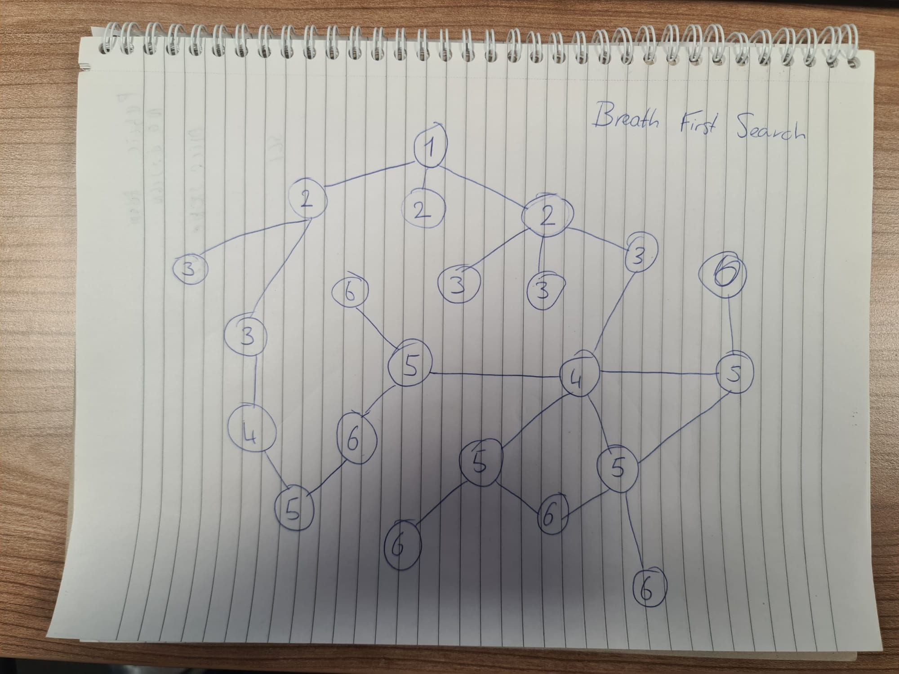
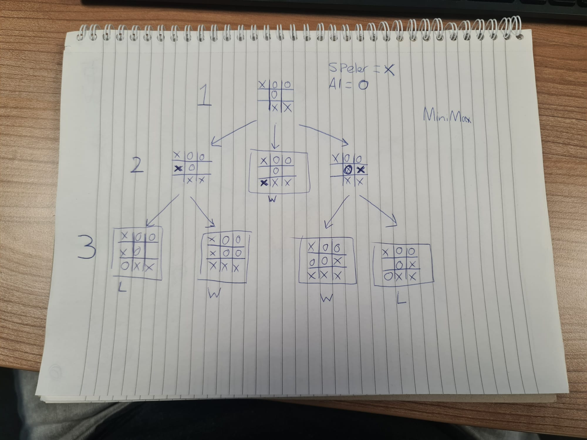

# Het verschil tussen traditionele AI en Machine Learning
AI is het brede concept van het menselijke intelligentie nabootsen, met als doel taken uit te voeren zoals leren en beslissingen nemen. Machine learning is een techniek binnen AI die computers in staat stelt te leren en zichzelf te verbeteren door gegevens te analyseren en deze te gebruiken voor taken zoals beeldherkenning, natuurlijke taalverwerking en aanbevelingssystemen.

# Het verschil tussen Breath First Search en Minimax
## Breath First Search
Deze algoritme kijkt naar de een bepaalde route. Hieronder heb ik een voorbeeld gemaakt. De algoritme begint bij node 1. Vervolgens kijkt die naar welke nodes de buren zijn en daar komt 2 te staan. Die kijkt dan naar waar de buren van 2 zijn en daar zet die 3 enzovoort.

## Minimax
Deze algoritme kijkt naar elke mogelijke stap die gezet kan worden per beurt. Laten we als voorbeeld boter kaas en eiren gebruiken. X zijn wij en O is de AI. De eerste stap is de begin scenario voor de uitleg. De tweede stap laat zien welke stappen wij kunnen zetten. Bij de eerste optie wint er nog niemand, dus krijgt O een beurt. O heeft dan 2 keuzes waarbij die of wint of verliest.

# De tijd-complexiteit van een zoekalgoritme
De tijdcomplexiteit van een alogirtme verwijst naar de mate waarin de rekentijd toeneemt naar mate de groote van de taak. Je wilt niet dat een algoritme oneindig stappen vooruitkijkt, maar een aantal stappen.